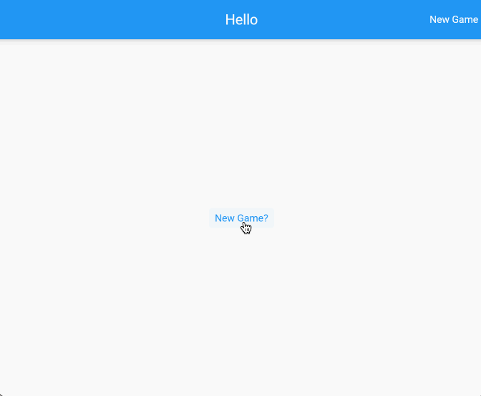
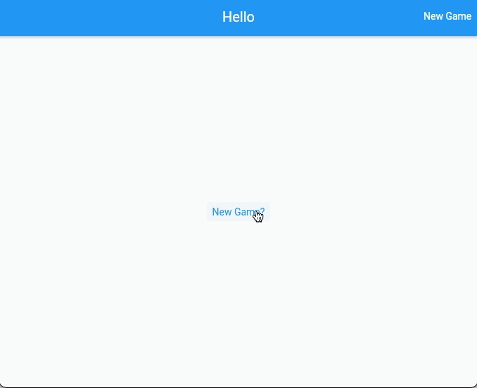
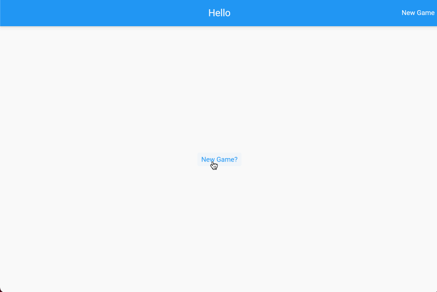
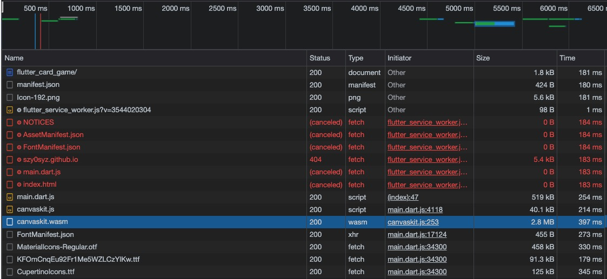

# flutter_card_game

> 从来没想过写个项目能那么 “自由” ! 从另一方面说是技术底层十分 “厚重”。

## Notes

- `card_model.dart`

```dart
enum Suit {
  Hearts,
  Clubs,
  Diamonds,
  Spades,
  Other,
}

class CardModel {
  final String image;
  final Suit suit;
  final String value;

  CardModel({
    required this.image,
    required this.suit,
    required this.value,
  });

  factory CardModel.fromJson(Map<String, dynamic> json) {
    return CardModel(
      image: json['image'],
      suit: stringToSuit(json['suit']),
      value: json['value'],
    );
  }

  static Suit stringToSuit(String suit) {
    switch (suit.toUpperCase().trim()) {
      case "HEARTS":
        return Suit.Hearts;
      case "CLUBS":
        return Suit.Clubs;
      case "DIAMONDS":
        return Suit.Diamonds;
      case "SPADES":
        return Suit.Spades;
      default:
        return Suit.Other;
    }
  }

  static String suitToString(Suit suit) {
    switch (suit) {
      case Suit.Hearts:
        return "Hearts";
      case Suit.Clubs:
        return "Clubs";
      case Suit.Diamonds:
        return "Diamonds";
      case Suit.Spades:
        return "Spades";
      case Suit.Other:
        return "Other";
    }
  }

  static String suitToUnicode(Suit suit) {
    switch (suit) {
      case Suit.Hearts:
        return "\u2665";
      case Suit.Clubs:
        return "\u2663";
      case Suit.Diamonds:
        return "\u2666";
      case Suit.Spades:
        return "\u2660";
      case Suit.Other:
        return "Other";
    }
  }

  static Color suitToColor(Suit suit) {
    switch (suit) {
      case Suit.Hearts:
      case Suit.Diamonds:
        return Colors.red;
      default:
        return Colors.black;
    }
  }
}
```

- `draw_model.dart`

```dart
class DrawModel {
  final int remaining;
  final List<Card> cards;

  DrawModel({required this.remaining, this.cards = const []});

  factory DrawModel.fromJson(Map<String, dynamic> json) {
    final cards =
        json["cards"].map<CardModel>((card) => CardModel.fromJson(card)).toList();

    return DrawModel(remaining: json['remaining'], cards: cards);
  }
}
```

> **以上两段代码真的十分“面向对象”，也是一种面向对象的思想。**
>
> 写太多了前端，还是很缺这样的思想的。

### use my “Provider”

```dart
void main() {
  runApp(MultiProvider(
    providers: [ChangeNotifierProvider(create: (_) => GameProvider())],
    child: const MyApp(),
  ));
}
```

```dart
class _GameScreenState extends State<GameScreen> {
  late final GameProvider _gameProvider;

  @override
  void initState() {
    _gameProvider = Provider.of<GameProvider>(context, listen: false);
    super.initState();
  }
}
```

关于 Flutter 中的状态管理

- 首页是定义 `provider` 的逻辑，这里可能还带有 `service` 的异步请求数据，还有整个当前领域的完整数据属性和转移这些状态的操作方法。但这里其实包含了传统意义上 “MVC” 层里的 `Controller` 那一层。
- 那又怎么写好这个 `mvc` 层里的 `provider` 呢？
- `provider` 应遵守管理的状态全部是 “领域数据”
- `provider` 里的数据属性应该是收敛且内聚的，不能有掺杂
- `provider` 所有会改变内部数据变化的方法全部定义在这个 `provider` 内，不允许出现外部 `外面` 改变 `里面` 的情况出现。有点废话了，`notifyListeners()` 方法又不可能随便调
- `provider` 这个类的属性，那些会变的数据，只能 `get` ，不能随意 `set`







> 越来越有点意思了。

### NavigatorKey

```dart
final navigatorKey = GlobalKey<NavigatorState>();
final rootScaffoldMessemgerKey = GlobalKey<ScaffoldMessengerState>();

class MyApp extends StatelessWidget {
  const MyApp({Key? key}) : super(key: key);

  @override
  Widget build(BuildContext context) {
    return MaterialApp(
      title: 'Flutter Card Game',
      navigatorKey: navigatorKey,
      scaffoldMessengerKey: rootScaffoldMessemgerKey,
      debugShowCheckedModeBanner: false,
      theme: ThemeData(
        primarySwatch: Colors.blue,
      ),
      home: const GameScreen(),
    );
  }
}
```

## Deploy



`flutter-web` 目前来看，还是不成气候的嘛。
